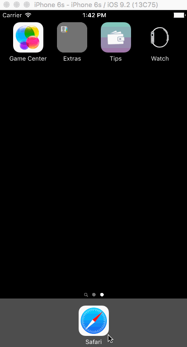

# Tip Calculator

This is an iOS tip calculator application for CodePath submission. 

Time spent: 4 hours spent in total

Completed user stories:

 * [x] Required: User enter a value for bill.
 * [x] Required: User will see a tip value and a total value  
 * [x] Required: User can choose a tip percentage
 
Notes:

Watched the video tutorial and some other how to’s to make welcome screen. 

Walkthrough of all user stories:

GIF created with [LiceCap](http://www.cockos.com/licecap/).
